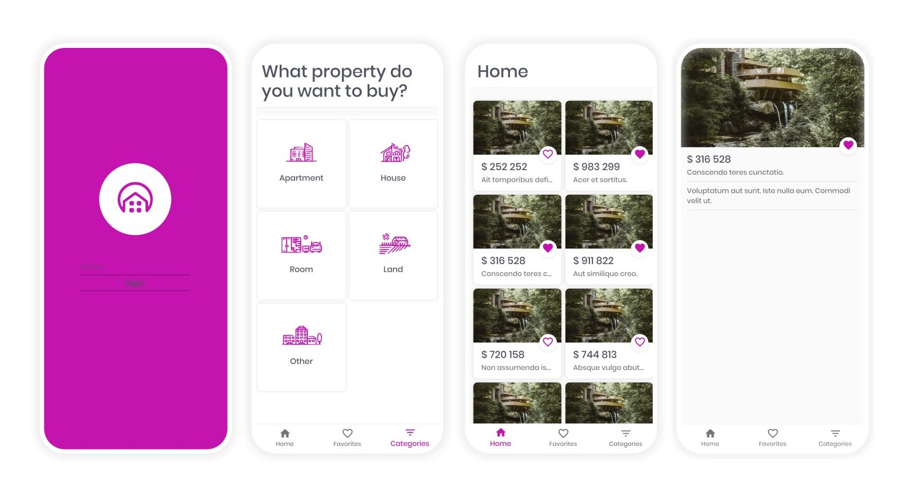

<h1 align="center">Welcome to Listopia 👋</h1>
<p>
  
  <a href="https://github.com/Nazeh/listopia/blob/develop/LICENSE" target="_blank">
    
  </a>
    <a href="https://github.com/nazeh/listopia#readme" target="_blank">
    
  </a>
  <a href="https://twitter.com/ArNazeh" target="_blank">
    
  </a>
</p>

> Listopia is an exercise in building a RESTful web app using React-Redux, and Rails API.



The goal is building a real-world-like project, built with business specifications. In which I had to build an MVP before a given deadline.

Find the code for the server-side API can, and the relevant documentation can at [**Listopia-Rails-Api**](https://github.com/Nazeh/listopia-RailsApi)

### ✨ [Demo](https://listopia.netlify.com/)

## 🔨 Tools

- Create-React-App
- React / React-Dom / React-Router-Dom
- Redux / React-Redux / Redux-thunk / Reselect
- Material UI
- Axios
- Styled Components

## 🎉 Features

- Mobile web app.
- Responsive layout.
- Shared state  managment.
- Structured, Semantic HTML.
- CRUD operations.
- Asynchronous data fetching.
- Front-end routing.
- Material Design.

### 🚧 Future development

- Proper Authentication/Authorization.
- Normalize Redux store.
- Optimize data fetching.
- Use Helmet for SOE.
- Build create/update postings form.
- Add support for storing/fetching images.

## 🚀 Getting Started

> This guide shows how to clone, install, start and develop the client-side in your local environment. But, it will fetch data from my remote deployed server. For running your own local server, clone the server-side repository: at [Listopia-Rails-Api](https://github.com/Nazeh/listopia-RailsApi).

### Clone

```sh
git clone git@github.com:Nazeh/listopia.git
cd listopia
```

### Install

```sh
npm install
```

### Usage

```sh
npm run start
```

### Run tests

```sh
npm run test
```

### Customize

Change files in the [**config**](./src/config/api.js) directory.

### Deploy

```sh
npm install netlify-cli -g
netlify login
netlify deploy --prod
```

## Author

👤 **Ar Nazeh**

* Twitter: [@ArNazeh](https://twitter.com/ArNazeh)
* Github: [@Nazeh](https://github.com/Nazeh)
* LinkedIn: [@arnazeh](https://linkedin.com/in/arnazeh)

## Credits

Design credits goes to the creators of [**Real Estate Classified App**]( https://www.behance.net/gallery/73279743/Real-Estate-Classified-App ) concept on Behance.

## 🤝 Contributing

Contributions, issues and feature requests are welcome!

## Show your support

Give a ⭐️ if you like this project!

***

## 📝 License

This project is [MIT](https://github.com/Nazeh/listopia/blob/develop/LICENSE) licensed.
